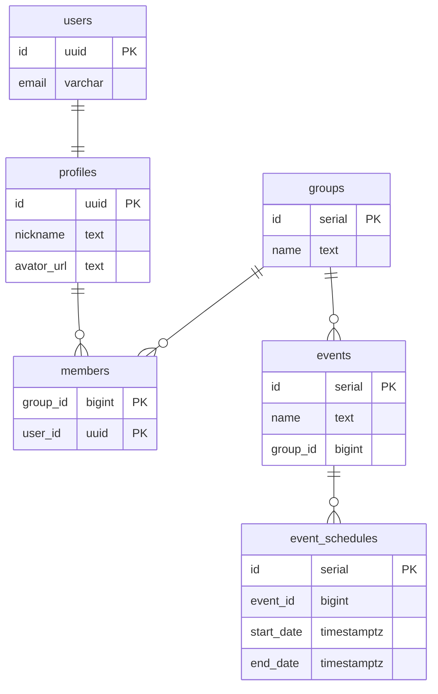

# react-protos

プロト作成をすぐに始められるように React ベースで多くの SPA に共通しそうな機能をセットアップしたサンプルプロジェクトです。

## 含めたもの

- ビルドツール、JS フレームワーク、プログラミング言語
  - [Vite](https://vitejs.dev/)
  - [React](https://reactjs.org/)
  - [TypeScript](https://www.typescriptlang.org/)
  - 参考にしたもの
    - [Vite で最速 React & TypeScript](https://zenn.dev/sprout2000/articles/98145cf2a807b1)
- 静的解析ツール、コードフォーマッター
  - [ESLint](https://eslint.org/)
  - [Prettier](https://prettier.io/)
  - 参考にしたもの
    - [Vite + React の環境構築](https://zenn.dev/kk6/scraps/36fa4579df6acb)
    - [prettier,eslintを導入する際にハマったこと2021新年](https://zenn.dev/ryusou/articles/nodejs-prettier-eslint2021)
    - [ESLintでimportの整列・追加・削除を自動化する](https://qiita.com/yukiji/items/5ba9e065ac6ed57d05a4)
- UIライブラリ
  - [Mantine](https://mantine.dev/)
  - 参考にしたもの
    - [Reactにおけるスタイリング手法まとめ](https://zenn.dev/chiji/articles/b0669fc3094ce3)
    - [ReactのUIライブラリメモ](https://zenn.dev/ynakamura/scraps/af397fdbe2ec21)
- ルーティング
  - [React Router](https://reactrouter.com/)
  - 参考にしたもの
    - [React: React Router v6 でルーティングする step１](https://zenn.dev/longbridge/articles/65355d3fdb7939)
    - [React: React Router v6 でルーティングする step２](https://zenn.dev/longbridge/articles/607ec2971c748e)
    - [React:React Router v6 で 認証されていないユーザーや権限がないユーザーをリダイレクトする](https://zenn.dev/longbridge/articles/61b05d8bdb014d)
- ステート管理
  - [React Query](https://react-query.tanstack.com/)
  - 参考にしたもの
    - [React Queryを状態管理ライブラリとして使い倒そう！/useQStateのススメ](https://qiita.com/uehaj/items/4e41e294181b3771e77a)
- 認証と認可
  - [Supabase](https://supabase.com/docs/)
  - 参考にしたもの
    - [Login With Email](https://supabase.com/docs/guides/auth/auth-email)
    - [Managing User Data](https://supabase.com/docs/guides/auth/managing-user-data)
    - [Row Level Security](https://supabase.com/docs/guides/auth/row-level-security)
- API
  - [GraphQL](https://graphql.org/)
  - [React Query](https://react-query.tanstack.com/)
  - [GraphQL Code Generator](https://www.graphql-code-generator.com/)
  - 参考にしたもの
    - [GraphQL Code Generator + React Queryの紹介](https://tech.hicustomer.jp/posts/graphql-codegen-react-query/)
    - [Guide: React and GraphQL](https://www.graphql-code-generator.com/docs/guides/react)
    - [TypeScript React-Query](https://www.graphql-code-generator.com/plugins/typescript-react-query)
- 非同期処理のハンドリング
  - [Suspense](https://react-query.tanstack.com/guides/suspense)
  - 参考にしたもの
    - [React QueryのSuspese Modeを使ってみた!](https://re-engines.com/2022/04/11/react-query-suspense/)
    - [React Query Error Handling](https://tkdodo.eu/blog/react-query-error-handling)

## これから含めるもの

- バリデーション
- 多言語対応
- モックライブラリ

## 動かすまで

- [Supabase](https://supabase.com/docs/)でプロジェクトを作ります。
- プロジェクトのルート直下に.envファイルを作成して環境変数を設定します。
  ```
  VITE_SUPABASE_URL=プロジェクトのURL
  VITE_SUPABASE_ENDPOINT=プロジェクトのGraphQLのURL
  VITE_SUPABASE_ANON_KEY=プロジェクトのAPIキー（anonキー）
  VITE_SUPABASE_PERSIST_SESSION=no
  ```
- SupabaseのダッシュボードからSQLを実行してテーブルやポリシー等を作成します。
  - [SQLでlikeを使えるようにSupabaseをカスタマイズ](./backend/sql/like_operation.sql)
  - [アプリのDDL](./backend/sql/all.sql)
- 次のコマンドでアプリを起動します。
  ```
  $ yarn
  $ yarn dev
  ```

## おすすめツール

- [Visual Studio Code](https://azure.microsoft.com/ja-jp/products/visual-studio-code/)
- [Altair GraphQL Client](https://altair.sirmuel.design/)

## ER図

[Entity Relationship Diagrams](https://mermaid-js.github.io/mermaid/#/entityRelationshipDiagram?id=entity-relationship-diagrams)


