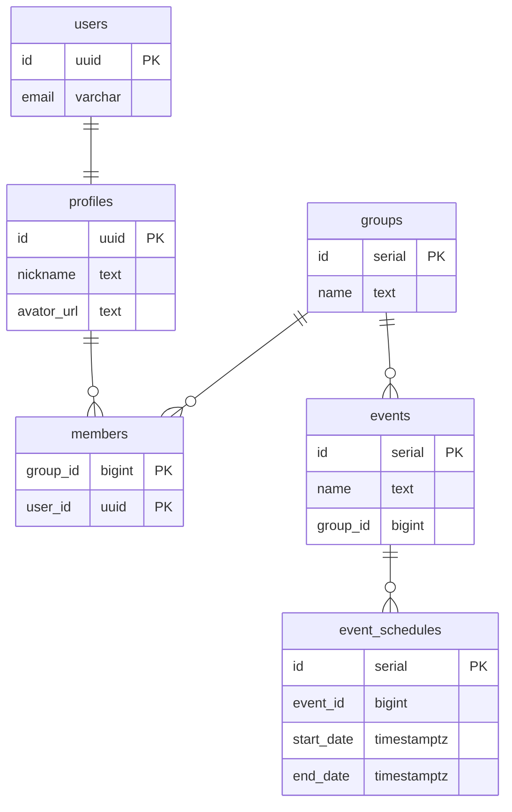

# react-protos

プロト作成をすぐに始められるように React ベースで多くの SPA に共通しそうな機能をセットアップしたサンプルプロジェクトです。

## 含めたもの

- ビルドツール、JS フレームワーク、プログラミング言語
  - [Vite](https://vitejs.dev/)
  - [React](https://reactjs.org/)
  - [TypeScript](https://www.typescriptlang.org/)
  - 参考にしたもの
    - [Vite で最速 React & TypeScript](https://zenn.dev/sprout2000/articles/98145cf2a807b1)
- 静的解析ツール、コードフォーマッター
  - [ESLint](https://eslint.org/)
  - [Prettier](https://prettier.io/)
  - 参考にしたもの
    - [Vite + React の環境構築](https://zenn.dev/kk6/scraps/36fa4579df6acb)
    - [prettier,eslintを導入する際にハマったこと2021新年](https://zenn.dev/ryusou/articles/nodejs-prettier-eslint2021)
- UIライブラリ
  - [Mantine](https://mantine.dev/)
  - 参考にしたもの
    - [Reactにおけるスタイリング手法まとめ](https://zenn.dev/chiji/articles/b0669fc3094ce3)
    - [ReactのUIライブラリメモ](https://zenn.dev/ynakamura/scraps/af397fdbe2ec21)
- ルーティング
  - [React Router](https://reactrouter.com/)
  - 参考にしたもの
    - [React: React Router v6 でルーティングする step１](https://zenn.dev/longbridge/articles/65355d3fdb7939)
    - [React: React Router v6 でルーティングする step２](https://zenn.dev/longbridge/articles/607ec2971c748e)
    - [React:React Router v6 で 認証されていないユーザーや権限がないユーザーをリダイレクトする](https://zenn.dev/longbridge/articles/61b05d8bdb014d)
- ステート管理
  - [React Query](https://react-query.tanstack.com/)
  - 参考にしたもの
    - [React Queryを状態管理ライブラリとして使い倒そう！/useQStateのススメ](https://qiita.com/uehaj/items/4e41e294181b3771e77a)
- 認証
  - [Supabase](https://supabase.com/docs/)
  - 参考にしたもの
    - [Login With Email](https://supabase.com/docs/guides/auth/auth-email)

## これから含めるもの

- API
  - [GraphQL](https://graphql.org/)
  - 参考にしたもの
    - [GraphQLのスキーマと型定義](https://qiita.com/NagaokaKenichi/items/d341dc092012e05d6606)
- モックライブラリ
- 非同期処理のハンドリング
- バリデーション
- 多言語対応

## ER図

