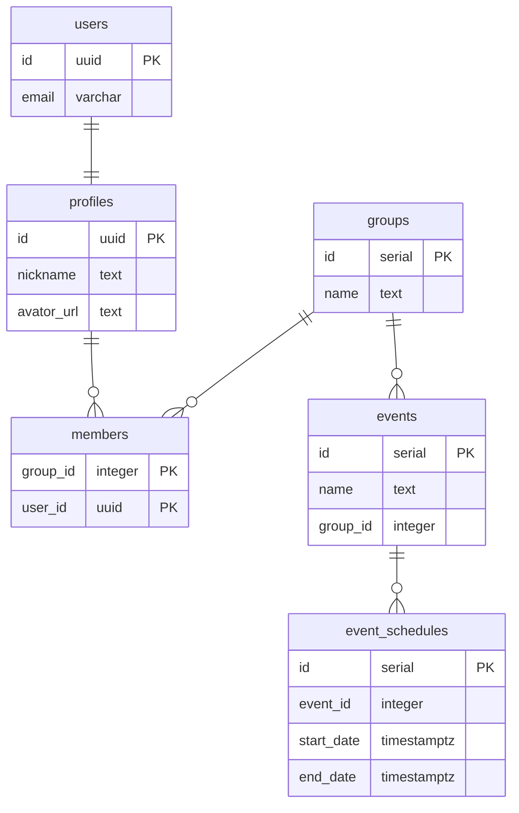
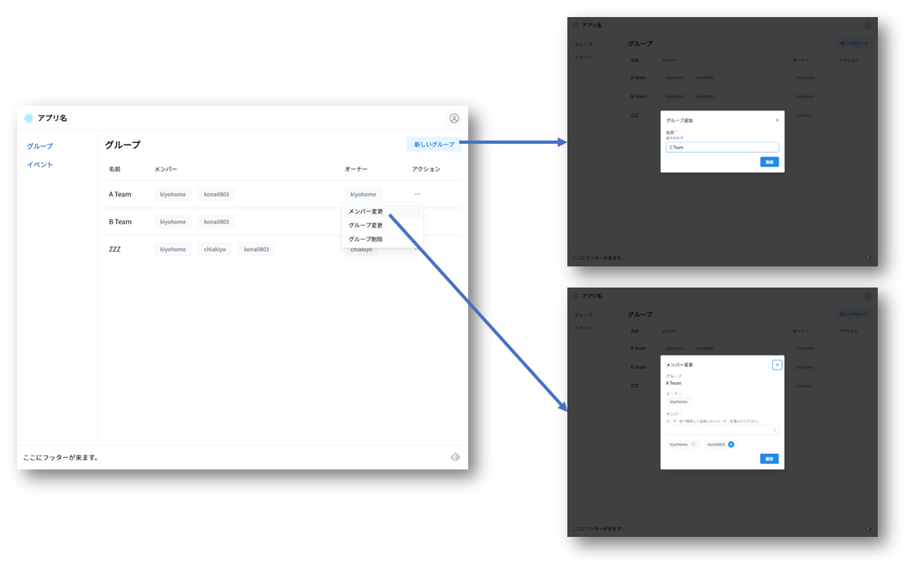

# react-protos

プロト作成をすぐに始められるようにReactベースで多くのSPAに共通しそうな機能をセットアップしたサンプルプロジェクトです。

### 含めたもの

- ビルドツール、JSフレームワーク、プログラミング言語
  - [Vite](https://vitejs.dev/)
  - [React](https://reactjs.org/)
  - [TypeScript](https://www.typescriptlang.org/)
  - 参考にしたもの
    - [Vite で最速 React & TypeScript](https://zenn.dev/sprout2000/articles/98145cf2a807b1)
- 静的解析ツール、コードフォーマッター
  - [ESLint](https://eslint.org/)
  - [Prettier](https://prettier.io/)
  - 参考にしたもの
    - [Vite + React の環境構築](https://zenn.dev/kk6/scraps/36fa4579df6acb)
    - [prettier,eslintを導入する際にハマったこと2021新年](https://zenn.dev/ryusou/articles/nodejs-prettier-eslint2021)
    - [ESLintでimportの整列・追加・削除を自動化する](https://qiita.com/yukiji/items/5ba9e065ac6ed57d05a4)
- UIライブラリ
  - [Mantine](https://mantine.dev/)
  - 参考にしたもの
    - [Reactにおけるスタイリング手法まとめ](https://zenn.dev/chiji/articles/b0669fc3094ce3)
    - [ReactのUIライブラリメモ](https://zenn.dev/ynakamura/scraps/af397fdbe2ec21)
- ルーティング
  - [React Router](https://reactrouter.com/)
  - 参考にしたもの
    - [React: React Router v6 でルーティングする step１](https://zenn.dev/longbridge/articles/65355d3fdb7939)
    - [React: React Router v6 でルーティングする step２](https://zenn.dev/longbridge/articles/607ec2971c748e)
    - [React:React Router v6 で 認証されていないユーザーや権限がないユーザーをリダイレクトする](https://zenn.dev/longbridge/articles/61b05d8bdb014d)
- ステート管理
  - [React Query](https://react-query.tanstack.com/)
  - 参考にしたもの
    - [React Queryを状態管理ライブラリとして使い倒そう！/useQStateのススメ](https://qiita.com/uehaj/items/4e41e294181b3771e77a)
- 認証と認可
  - [Supabase](https://supabase.com/docs/)
  - 参考にしたもの
    - [Login With Email](https://supabase.com/docs/guides/auth/auth-email)
    - [Managing User Data](https://supabase.com/docs/guides/auth/managing-user-data)
    - [Row Level Security](https://supabase.com/docs/guides/auth/row-level-security)
- API
  - [GraphQL](https://graphql.org/)
  - [React Query](https://react-query.tanstack.com/)
  - [GraphQL Code Generator](https://www.graphql-code-generator.com/)
  - 参考にしたもの
    - [GraphQL Code Generator + React Queryの紹介](https://tech.hicustomer.jp/posts/graphql-codegen-react-query/)
    - [Guide: React and GraphQL](https://www.graphql-code-generator.com/docs/guides/react)
    - [TypeScript React-Query](https://www.graphql-code-generator.com/plugins/typescript-react-query)
- 非同期処理のハンドリング
  - [Suspense](https://react-query.tanstack.com/guides/suspense)
  - 参考にしたもの
    - [React QueryのSuspese Modeを使ってみた!](https://re-engines.com/2022/04/11/react-query-suspense/)
    - [React Query Error Handling](https://tkdodo.eu/blog/react-query-error-handling)
- 多言語対応
  - [i18next](https://www.i18next.com/)
  - 参考にしたもの
    - [Reactで簡単に多言語対応する方法は？react-i18nextの使い方](https://devlog.atlas.jp/2021/12/08/4140)
    - [i18next + i18next-browser-languagedetectorでの開発時には、localStorageに注意する](https://wp-kyoto.net/should-remove-localstorage-when-debugging-i18next-browser-lang-detector/)
- バリデーション
  - [Zod](https://zod.dev/)
  - 参考にしたもの
    - [TypeScriptファーストなバリデーションライブラリ Zodの始め方](https://qiita.com/kjkj_ongr/items/0eff5173b6e4fce7fbe8)

## これから含めるもの

- モックライブラリ

## 動かすまで

- [Supabase](https://supabase.com/docs/)でプロジェクトを作ります。
- プロジェクトのルート直下に.envファイルを作成して環境変数を設定します。
  ```
  VITE_SUPABASE_URL=プロジェクトのURL
  VITE_SUPABASE_ENDPOINT=プロジェクトのGraphQLのURL
  VITE_SUPABASE_ANON_KEY=プロジェクトのAPIキー（anonキー）
  VITE_SUPABASE_PERSIST_SESSION=no
  ```
- SupabaseのダッシュボードからSQLを実行してテーブルやポリシー等を作成します。
  - [SQLでlikeを使えるようにSupabaseをカスタマイズ](./backend/sql/like_operation.sql)
  - [アプリのDDL](./backend/sql/all.sql)
- 次のコマンドでアプリを起動します。
  ```
  $ yarn
  $ yarn dev
  ```

## アプリの仕様

イベントの参加者を募集できるようなアプリです。

- 誰でもサインアップしてユーザーになれます。
- イベントの作成者しかイベントを操作できないと困るのでイベントはグループで管理します。
- 誰でもグループを作成し、作成した人がオーナーになります。
- あるグループのメンバーが作成したイベントは同じグループのメンバーであれば誰でも操作できます。
- オーナーだけだグループの変更やメンバー変更を行えます。
- まとめると、イベントの作成や変更を行うには、グループを新しく作るか、既にあるグループのオーナーに連絡してグループのメンバーに追加してもらう必要があります。

## アプリの機能

### 出来ているもの

- サインイン、サインアップ、サインアウト
- グループのCRUD

### これから

- イベントのCRUD
- イベントへの参加

## アプリのテーブル

[Entity Relationship Diagrams](https://mermaid-js.github.io/mermaid/#/entityRelationshipDiagram?id=entity-relationship-diagrams)



## アプリの認可ルール

### profiles

|操作|できる人|
|---|---|
|SELECT|サインイン済みユーザーのみ|
|INSERT|誰でも（＝サインアップ）|
|UPDATE|自分のみ|
|DELETE|自分のみ|

### groups

|操作|できる人|
|---|---|
|SELECT|サインイン済みユーザーのみ|
|INSERT|サインイン済みユーザーのみ|
|UPDATE|オーナーのみ|
|DELETE|オーナーのみ|

### members

|操作|できる人|
|---|---|
|SELECT|同じグループのメンバーのみ|
|INSERT|オーナーのみ|
|UPDATE|いない|
|DELETE|オーナーのみ|

### events、event_schedules

|操作|できる人|
|---|---|
|SELECT|同じグループのメンバーのみ|
|INSERT|同じグループのメンバーのみ|
|UPDATE|同じグループのメンバーのみ|
|DELETE|同じグループのメンバーのみ|

## 開発ガイド

### ディレクトリ構成

```
src
├─generated   ->GraphQLスキーマから自動生成したコード
├─graphql     ->GraphQLのQuery/Mutation
├─hooks       ->Reactのフック
├─i18n        ->多言語対応のリソースファイル
└─pages       ->Reactのコンポーネント（ページやモーダル）
    ├─events  ->イベント操作
    └─groups  ->グループ操作
```

### 開発ツール

- [Visual Studio Code](https://azure.microsoft.com/ja-jp/products/visual-studio-code/)
- [Altair GraphQL Client](https://altair.sirmuel.design/)

### コマンド

```
$ yarn
```

パッケージをインストールします。

```
$ yarn dev
```
アプリを起動してブラウザが開きます。

```
$ yarn lint
```

静的解析をしてフォーマットします。

## UI

基本のUIは一覧ページから対象を選んで詳細ページを表示して操作を行います。
操作対象が単純な場合は詳細ページを作らず一覧ページから操作を行います。
操作はモーダルで行います。
ページやモーダルは[Mantine](https://mantine.dev/)で作成します。



## ルーティング

一覧ページや詳細ページはリンクの共有やブックマークできるようにパスを設けます。
操作を行う際に開くモーダルは利用目的がないため基本的にパスを設けません。
サインインとサインアップのみリンクを共有するケースがあるためパスを設けます。
一覧ページは「対象の名前」、詳細ページは「対象の名前/ID」をパスとします。

```
イベント一覧
http://localhost:3000/events

イベント詳細
http://localhost:3000/events/1

サインイン
http://localhost:3000/signin
```

ルーティングは[React Router](https://reactrouter.com/)で行います。

```
/src/RouterConfig.tsx

<BrowserRouter>
  <Routes>
    <Route path="/" element={<AppLayout />}>
      <Route index element={<WelcomePage />} />
      <Route path="signup" element={<SignUpPage />} />
      <Route path="signin" element={<SignInPage />} />
      <Route
        path="groups"
        element={
          <AccessControl>
            <GroupsPage />
          </AccessControl>
        }
      />
      <Route
        path="events"
        element={
          <AccessControl>
            <EventsPage />
          </AccessControl>
        }
      />
      <Route path="*" element={<PageNotFoundPage />} />
    </Route>
  </Routes>
</BrowserRouter>
```

サインインが必要なページはAccessControlコンポーネントで囲います。

```
<Route
  path="groups"
  element={
    <AccessControl>
      <GroupsPage />
    </AccessControl>
  }
/>
```
