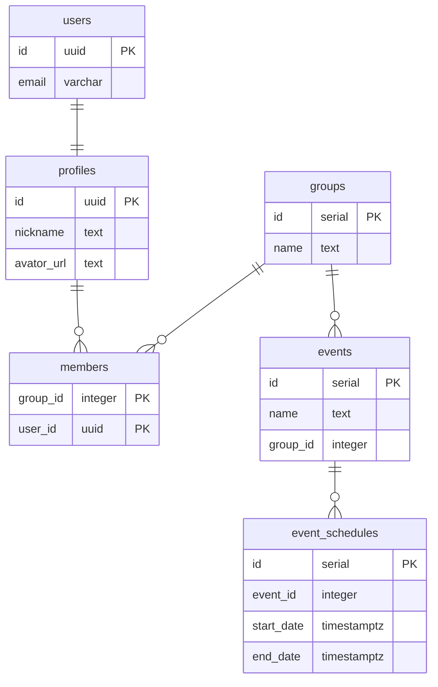

# アプリ

プロジェクトを動作確認するために作成したアプリのスペックです。

## スペック

イベントを作成し参加者を募集するアプリです。

- 誰でもサインアップしてユーザーになれます。
- イベントの作成者しかイベントを操作できないと困るのでイベントはグループで管理します。
- イベントの作成や変更を行うには、グループを新しく作るか、既にあるグループのオーナーに連絡してグループのメンバーに追加してもらう必要があります。
- 誰でもグループを作成し、作成した人がオーナーになります。
- あるグループのメンバーが作成したイベントは同じグループのメンバーであれば誰でも操作できます。
- オーナーだけがグループの変更やメンバーの変更を行えます。

## 出来ているもの

- サインイン、サインアップ、サインアウト
- グループのCRUD

## これから

- イベントのCRUD
- イベントへの参加

## データモデル

[Entity Relationship Diagrams](https://mermaid-js.github.io/mermaid/#/entityRelationshipDiagram?id=entity-relationship-diagrams)

## 認可ルール

### profiles

|操作|できる人|
|---|---|
|SELECT|サインイン済みユーザーのみ|
|INSERT|誰でも（＝サインアップ）|
|UPDATE|自分のみ|
|DELETE|自分のみ|

### groups

|操作|できる人|
|---|---|
|SELECT|サインイン済みユーザーのみ|
|INSERT|サインイン済みユーザーのみ|
|UPDATE|オーナーのみ|
|DELETE|オーナーのみ|

### members

|操作|できる人|
|---|---|
|SELECT|同じグループのメンバーのみ|
|INSERT|オーナーのみ|
|UPDATE|いない|
|DELETE|オーナーのみ|

### events、event_schedules

|操作|できる人|
|---|---|
|SELECT|同じグループのメンバーのみ|
|INSERT|同じグループのメンバーのみ|
|UPDATE|同じグループのメンバーのみ|
|DELETE|同じグループのメンバーのみ|
