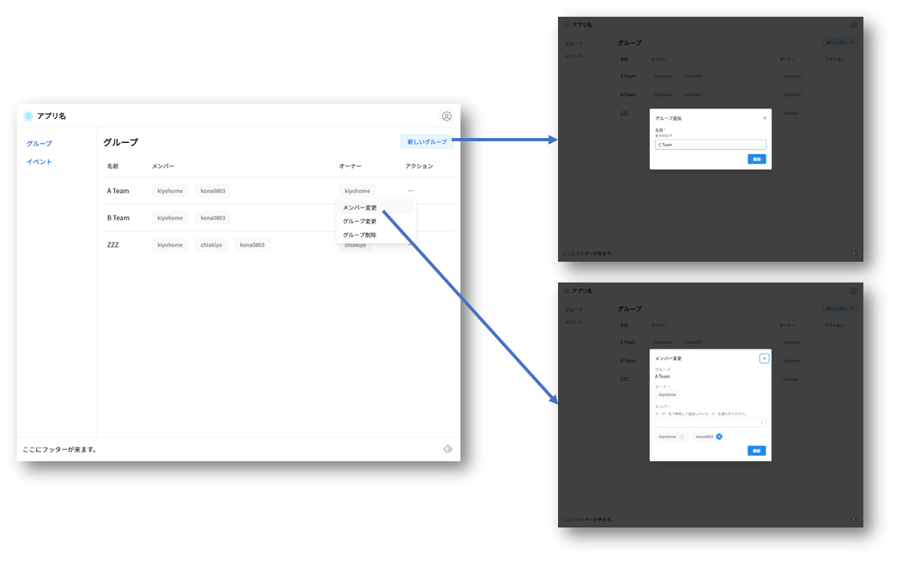

# UI

レイアウトはヘッダー、ナビゲーション、コンテンツ、フッターです。
ナビゲーションにアプリで扱う対象が並び、その対象を選択してコンテンツを切り替えます。
コンテンツでは一覧ページから対象を選んで詳細ページを表示して操作を行います。
操作対象が単純な場合は詳細ページを作らず一覧ページから操作を行います。
基本的な操作はモーダルで行います。
ページやモーダルは[Mantine](https://mantine.dev/)で作成します。



レイアウトは[AppLayout](https://github.com/kiyohome/react-protos/blob/main/src/pages/AppLayout.tsx)で定義しています。
ヘッダー、ナビゲーション、フッターの内容もAppLayoutに実装しています。
ナビゲーションの内容を変えたい場合はAppLayout内の次の配列を変更します。

```jsx
const links = [
  { label: t('groups'), path: '/groups' },
  { label: t('events'), path: '/events' },
];
```
